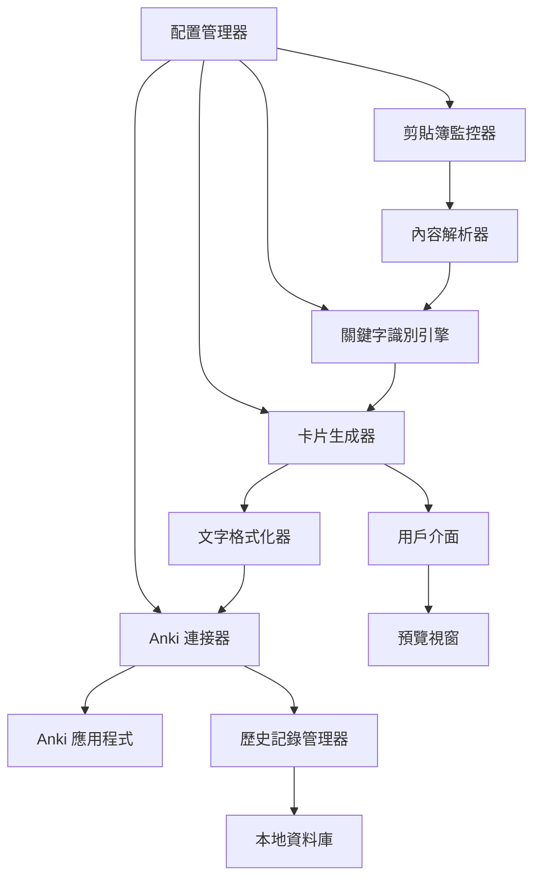

# 設計文件

## 概述

基於關鍵字的 Anki 卡片自動生成器是一個 Python 應用程式，它監控系統剪貼簿，當檢測到包含特定關鍵字的文字內容時，自動解析並生成格式化的 Anki 卡片，然後通過 AnkiConnect API 匯入到用戶的 Anki 應用程式中。

系統的核心價值在於：
1. **自動化學習卡片創建** - 消除手動輸入的繁瑣過程
2. **智能內容識別** - 基於關鍵字自動識別不同類型的學習材料
3. **格式化優化** - 自動改善文字格式，提升可讀性
4. **無縫整合** - 直接匯入到 Anki，無需額外步驟

## 架構

### 系統架構圖



### 分層架構

1. **表現層 (Presentation Layer)**
   - CLI 介面
   - 預覽視窗
   - 狀態顯示

2. **業務邏輯層 (Business Logic Layer)**
   - 關鍵字識別引擎
   - 卡片生成邏輯
   - 內容解析器

3. **服務層 (Service Layer)**
   - 剪貼簿監控服務
   - Anki 連接服務
   - 配置管理服務

4. **資料層 (Data Layer)**
   - 配置檔案
   - 歷史記錄資料庫
   - 關鍵字規則庫

## 組件和介面

### 1. 剪貼簿監控器 (ClipboardManager)

**職責：**
- 持續監控系統剪貼簿變化
- 提供跨平台剪貼簿存取
- 實現內容快取以避免重複處理

**介面：**
```python
class ClipboardManager:
    def get_clipboard() -> str
    def has_new_content() -> bool
    def test_access() -> bool
    def clear_cache() -> None
```

### 2. 關鍵字識別引擎 (KeywordEngine)

**職責：**
- 分析文字內容中的關鍵字
- 根據關鍵字類型決定卡片模板
- 支援多語言關鍵字識別
- 提供可配置的關鍵字規則

**介面：**
```python
class KeywordEngine:
    def identify_keywords(content: str) -> List[Keyword]
    def get_card_template(keywords: List[Keyword]) -> CardTemplate
    def add_custom_keyword(keyword: str, template: str) -> None
    def remove_keyword(keyword: str) -> None
```

**關鍵字類型：**
- **問答型** (Q&A): "question:", "answer:", "問題:", "答案:"
- **選擇題型** (MCQ): "optionA:", "optionB:", "選項A:", "選項B:"
- **解釋型** (Explanation): "note:", "explanation:", "解釋:", "說明:"
- **定義型** (Definition): "definition:", "define:", "定義:", "解釋:"
- **列表型** (List): "•", "-", "1.", "2.", bullet points

### 3. 內容解析器 (ContentParser)

**職責：**
- 解析不同格式的文字內容
- 提取結構化資訊
- 處理多種輸入格式
- 驗證內容完整性

**介面：**
```python
class ContentParser:
    def parse(content: str, template: CardTemplate) -> ParsedContent
    def extract_structured_data(content: str) -> Dict[str, str]
    def validate_content(content: ParsedContent) -> bool
```

### 4. 文字格式化器 (TextFormatter)

**職責：**
- 改善文字可讀性
- 添加適當的換行和段落分隔
- 轉換為 HTML 格式
- 保持原始格式結構

**介面：**
```python
class TextFormatter:
    def format_for_anki(text: str, field_type: str) -> str
    def add_line_breaks(text: str) -> str
    def format_lists(text: str) -> str
    def preserve_structure(text: str) -> str
```

**格式化規則：**
- 長句子自動斷行（超過 80 字符）
- 項目符號和編號列表格式化
- 段落間添加適當間距
- 重要內容高亮顯示
- 保持原始縮排結構

### 5. 卡片生成器 (CardGenerator)

**職責：**
- 根據模板生成 Anki 卡片
- 映射欄位到 Anki 模型
- 添加標籤和元資料
- 生成唯一識別碼

**介面：**
```python
class CardGenerator:
    def generate_card(content: ParsedContent, template: CardTemplate) -> AnkiCard
    def map_fields(content: ParsedContent, model: AnkiModel) -> Dict[str, str]
    def add_metadata(card: AnkiCard) -> AnkiCard
```

### 6. Anki 連接器 (AnkiConnector)

**職責：**
- 與 Anki 應用程式通信
- 管理連接狀態
- 處理匯入錯誤
- 檢查重複卡片

**介面：**
```python
class AnkiConnector:
    def connect() -> bool
    def import_card(card: AnkiCard) -> int
    def check_duplicate(card: AnkiCard) -> bool
    def get_deck_info(deck_name: str) -> DeckInfo
```

### 7. 配置管理器 (ConfigManager)

**職責：**
- 管理應用程式配置
- 處理用戶自定義設定
- 保存和載入配置檔案
- 提供預設值

**介面：**
```python
class ConfigManager:
    def load_config(file_path: str) -> Config
    def save_config(config: Config, file_path: str) -> None
    def get_default_config() -> Config
    def update_setting(key: str, value: Any) -> None
```

### 8. 歷史記錄管理器 (HistoryManager)

**職責：**
- 記錄匯入歷史
- 提供查詢功能
- 管理記錄清理
- 統計資訊收集

**介面：**
```python
class HistoryManager:
    def record_import(card: AnkiCard, timestamp: datetime) -> None
    def get_history(limit: int = 50) -> List[ImportRecord]
    def clear_history(before_date: datetime = None) -> None
    def get_statistics() -> ImportStats
```

## 資料模型

### 1. 關鍵字模型 (Keyword)

```python
@dataclass
class Keyword:
    text: str
    type: KeywordType
    language: str
    priority: int
    template_id: str
```

### 2. 卡片模板 (CardTemplate)

```python
@dataclass
class CardTemplate:
    id: str
    name: str
    field_mapping: Dict[str, str]
    anki_model: str
    default_tags: List[str]
    formatting_rules: Dict[str, str]
```

### 3. 解析內容 (ParsedContent)

```python
@dataclass
class ParsedContent:
    content_type: str
    fields: Dict[str, str]
    metadata: Dict[str, Any]
    source_hash: str
    timestamp: datetime
```

### 4. Anki 卡片 (AnkiCard)

```python
@dataclass
class AnkiCard:
    deck_name: str
    model_name: str
    fields: Dict[str, str]
    tags: List[str]
    note_id: Optional[int] = None
```

### 5. 匯入記錄 (ImportRecord)

```python
@dataclass
class ImportRecord:
    id: str
    timestamp: datetime
    content_hash: str
    card_count: int
    deck_name: str
    status: ImportStatus
    error_message: Optional[str] = None
```

## 錯誤處理

### 錯誤類型層次

```python
class AnkiGeneratorError(Exception):
    """基礎異常類別"""
    pass

class ClipboardError(AnkiGeneratorError):
    """剪貼簿相關錯誤"""
    pass

class ParseError(AnkiGeneratorError):
    """內容解析錯誤"""
    pass

class AnkiConnectionError(AnkiGeneratorError):
    """Anki 連接錯誤"""
    pass

class DuplicateCardError(AnkiGeneratorError):
    """重複卡片錯誤"""
    pass

class ConfigurationError(AnkiGeneratorError):
    """配置錯誤"""
    pass
```

### 錯誤處理策略

1. **剪貼簿錯誤**
   - 自動重試機制（最多 3 次）
   - 降級到基本文字模式
   - 記錄錯誤但繼續運行

2. **解析錯誤**
   - 嘗試多種解析策略
   - 提供預設格式作為後備
   - 向用戶顯示解析失敗的內容

3. **Anki 連接錯誤**
   - 檢查 Anki 是否運行
   - 驗證 AnkiConnect 插件
   - 提供重新連接選項

4. **重複卡片錯誤**
   - 跳過重複內容
   - 記錄重複統計
   - 可選擇更新現有卡片

## 測試策略

### 1. 單元測試

**測試覆蓋範圍：**
- 關鍵字識別準確性
- 內容解析正確性
- 格式化輸出驗證
- 配置管理功能
- 錯誤處理邏輯

**測試工具：**
- pytest 作為測試框架
- unittest.mock 用於模擬外部依賴
- coverage.py 用於測試覆蓋率分析

### 2. 整合測試

**測試場景：**
- 端到端工作流程測試
- Anki 連接整合測試
- 剪貼簿監控測試
- 多語言內容處理測試

### 3. 效能測試

**測試指標：**
- 剪貼簿檢查延遲 (< 100ms)
- 內容解析時間 (< 500ms)
- 記憶體使用量 (< 50MB)
- Anki 匯入速度 (< 1s per card)

### 4. 用戶接受測試

**測試案例：**
- 不同格式的學習材料
- 多語言內容處理
- 大量內容批次處理
- 長時間運行穩定性

## 效能考量

### 1. 記憶體優化

- 使用 `deque` 限制快取大小
- 定期清理處理過的內容雜湊
- 延遲載入大型配置檔案
- 實現垃圾回收機制

### 2. CPU 優化

- 編譯正則表達式模式
- 使用多執行緒處理長時間操作
- 實現內容變化檢測避免重複處理
- 優化字串操作和比較

### 3. I/O 優化

- 批次處理 Anki API 呼叫
- 實現連接池管理
- 使用非同步 I/O 處理剪貼簿
- 快取常用的 Anki 模型資訊

### 4. 網路優化

- 實現重試機制和指數退避
- 設定合理的超時時間
- 使用連接保持活躍
- 壓縮大型資料傳輸

## 安全考量

### 1. 資料隱私

- 不記錄敏感的剪貼簿內容
- 使用雜湊值而非原始內容進行重複檢測
- 提供資料清理功能
- 遵循最小權限原則

### 2. 系統安全

- 驗證所有外部輸入
- 防止程式碼注入攻擊
- 限制檔案系統存取權限
- 安全地處理異常和錯誤

### 3. 網路安全

- 驗證 AnkiConnect 連接
- 使用 HTTPS（如果可用）
- 實現請求速率限制
- 防止惡意內容注入

## 部署和維護

### 1. 安裝需求

- Python 3.8+
- Anki 2.1.50+
- AnkiConnect 插件
- 跨平台剪貼簿支援

### 2. 配置檔案

- JSON 格式的主配置檔案
- 可選的用戶自定義關鍵字檔案
- 日誌配置檔案
- 模板定義檔案

### 3. 監控和日誌

- 結構化日誌記錄
- 效能指標收集
- 錯誤統計和報告
- 健康檢查端點

### 4. 更新機制

- 配置檔案版本管理
- 向後相容性保證
- 自動遷移腳本
- 用戶通知機制